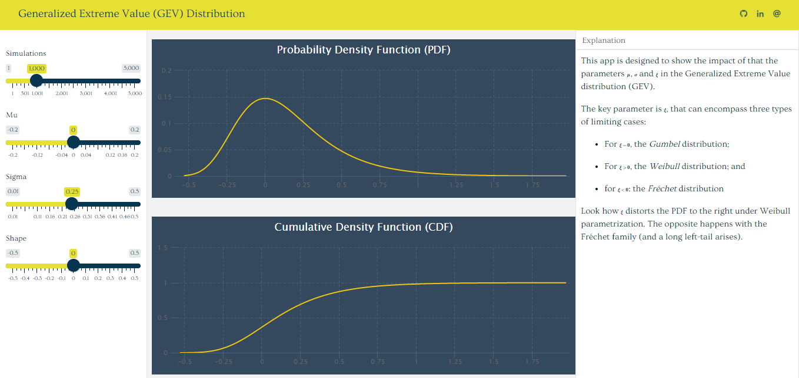

<!-- README.md is generated from README.Rmd. Please edit that file -->

```{r, include = FALSE}
knitr::opts_chunk$set(
  collapse = TRUE,
  echo = FALSE,
  comment = "#>"
)
```

# GEV Simulation

This a simple designed to show the impact of the parameters $\mu$, $\sigma$ and $\xi$ in the 
PDF and CDF of a [GEV distribution](https://en.wikipedia.org/wiki/Generalized_extreme_value_distribution).

```{r}

```
