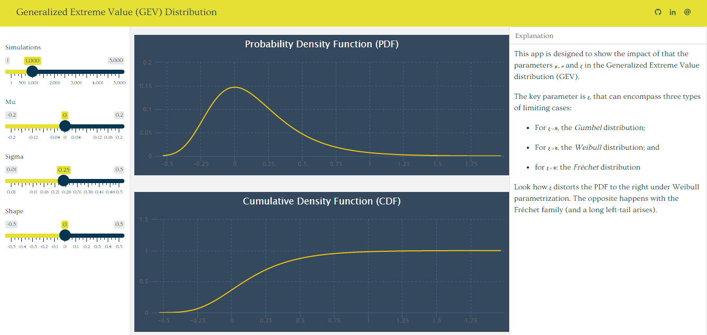

<!-- README.md is generated from README.Rmd. Please edit that file -->

# GEV Simulation

This a simple app designed to show the impact of the parameters *μ*, *σ*
and *ξ* in the PDF and CDF of a [GEV
distribution](https://en.wikipedia.org/wiki/Generalized_extreme_value_distribution).

